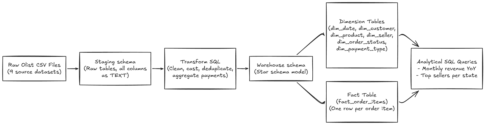
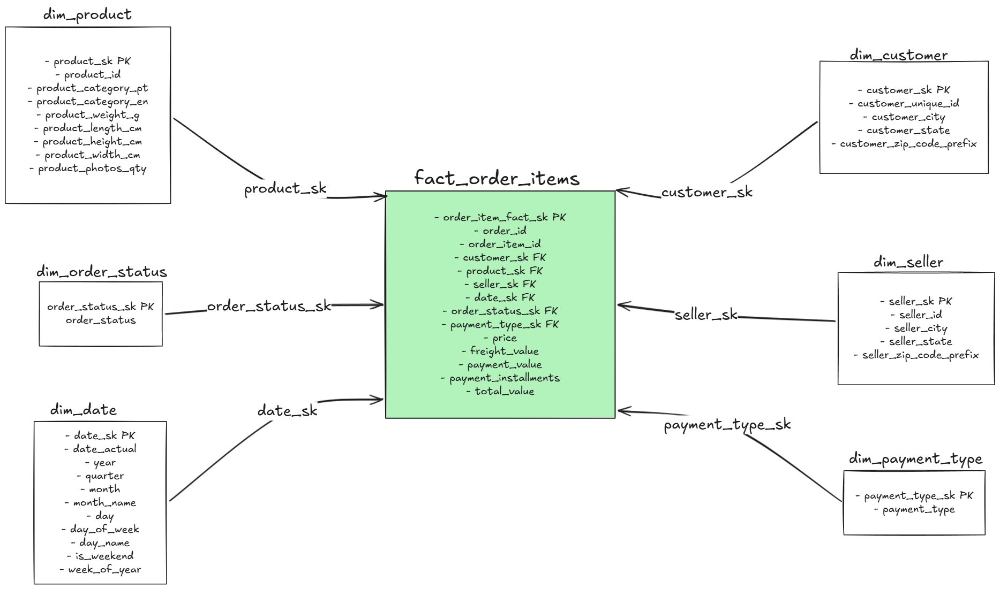
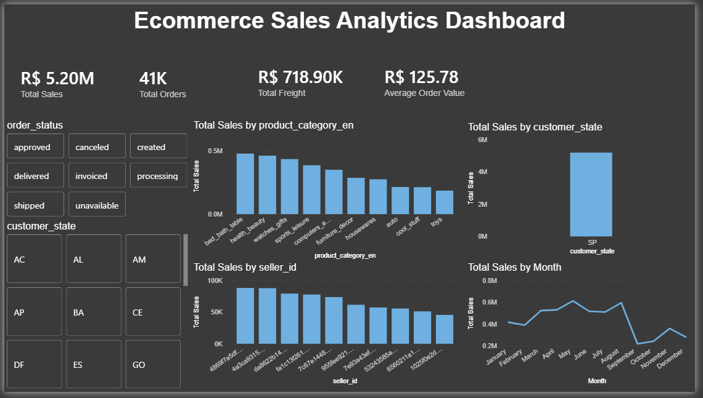

# E-Commerce Data Warehouse

PostgreSQL data warehouse project built on the Olist Brazilian e-commerce dataset. The project loads raw CSV files into staging tables, transforms them into a clean star schema, and provides analytical SQL queries for revenue and seller performance reporting.

## Project Overview

This project demonstrates an end-to-end SQL data warehousing workflow:

- Raw CSV ingestion into a dedicated `staging` schema
- Star schema design in a `warehouse` schema
- Dimension and fact table creation with primary keys, foreign keys, and indexes
- Data transformation from text-based staging tables into typed warehouse tables
- Fact table built at one row per order item
- Analytical queries using CTEs and window functions

## ETL Flow Diagram



## Tech Stack

- PostgreSQL
- SQL
- psql `\copy` for CSV loading
- Star schema data modeling
- Power BI for data visualization and dashboarding

## Dataset

The project uses 9 Olist e-commerce CSV files:

- `olist_customers_dataset.csv`
- `olist_orders_dataset.csv`
- `olist_order_items_dataset.csv`
- `olist_order_payments_dataset.csv`
- `olist_order_reviews_dataset.csv`
- `olist_products_dataset.csv`
- `olist_sellers_dataset.csv`
- `olist_geolocation_dataset.csv`
- `product_category_name_translation.csv`

The `data/` folder is ignored by Git, so the CSV files must be added locally before running the load script.

## Project Structure

```text
ecommerce-dw/
|-- data/                         # Local CSV files, ignored by Git
|-- sql/
|   |-- 01_create_staging.sql      # Creates raw staging tables
|   |-- 02_load_data.sql           # Loads CSVs into staging
|   |-- 03_create_dim_fact.sql     # Creates warehouse dimensions and fact table
|   |-- 04_transform_load.sql      # Transforms staging data into warehouse tables
|   `-- queries/
|       |-- 01_monthly_revenue_yoy.sql
|       `-- 02_top_sellers_per_state.sql
|-- powerbi/
|   `-- Ecommerce_Sales_Dashboard.pbix  # Interactive Power BI dashboard
|-- diagrams/
|   |-- etl-flow.png
|   `-- star-schema.png
|-- docs/
|   `-- dashboard_screenshot.png        # Power BI dashboard screenshot
`-- README.md
```

## Warehouse Model

The warehouse uses a star schema.


### Star Schema Diagram

### Dimension Tables

- `warehouse.dim_date`
- `warehouse.dim_customer`
- `warehouse.dim_product`
- `warehouse.dim_seller`
- `warehouse.dim_order_status`
- `warehouse.dim_payment_type`

### Fact Table

- `warehouse.fact_order_items`

Fact grain: one row per item per order.

Key measures:

- `price`
- `freight_value`
- `payment_value`
- `payment_installments`
- `total_value`, generated as `price + freight_value`

## How To Run

Create the PostgreSQL database:

```bash
createdb ecommerce_dw
```

Run the scripts in order:

```bash
psql -h localhost -p 5433 -U postgres -d ecommerce_dw -f sql/01_create_staging.sql
psql -h localhost -p 5433 -U postgres -d ecommerce_dw -f sql/02_load_data.sql
psql -h localhost -p 5433 -U postgres -d ecommerce_dw -f sql/03_create_dim_fact.sql
psql -h localhost -p 5433 -U postgres -d ecommerce_dw -f sql/04_transform_load.sql
```

Note: `02_load_data.sql` uses absolute file paths for the local CSV files. If your project is stored in a different folder, update the paths in that file before running it.

## Analytical Queries

Run the sample analytics queries after the warehouse is loaded:

```bash
psql -h localhost -p 5433 -U postgres -d ecommerce_dw -f sql/queries/01_monthly_revenue_yoy.sql
psql -h localhost -p 5433 -U postgres -d ecommerce_dw -f sql/queries/02_top_sellers_per_state.sql
```

Included analyses:

- Monthly delivered-order revenue with year-over-year growth
- Top 3 sellers per Brazilian state by delivered-order revenue

## Power BI Dashboard

A comprehensive Power BI dashboard (`Ecommerce_Sales_Dashboard.pbix`) is included in the `powerbi/` folder for interactive data visualization and analysis.



### Opening the Dashboard

1. Download and install [Power BI Desktop](https://powerbi.microsoft.com/en-us/desktop/)
2. Open the `powerbi/Ecommerce_Sales_Dashboard.pbix` file
3. When prompted, update the data source connection to point to your local PostgreSQL database
4. Refresh the data to load the latest warehouse tables

### Dashboard Features

The dashboard provides interactive visualizations including:

- **Revenue Analytics**: Monthly and yearly revenue trends with growth indicators
- **Sales Performance**: Top-performing sellers and product categories
- **Customer Insights**: Customer distribution by state, order count, and average order value
- **Payment Analysis**: Payment method distribution and installment patterns
- **Order Status Tracking**: Order fulfillment metrics and delivery performance
- **Geographic Analysis**: Sales performance mapped by Brazilian states with geo-visualization

### Dashboard Components

The dashboard connects to the warehouse tables:

- `warehouse.fact_order_items` (fact table)
- `warehouse.dim_customer`
- `warehouse.dim_seller`
- `warehouse.dim_product`
- `warehouse.dim_date`
- `warehouse.dim_order_status`
- `warehouse.dim_payment_type`

### Prerequisites for Dashboard

Before using the dashboard, ensure:

- PostgreSQL database is populated with the transformed warehouse data
- Power BI Desktop is installed
- Network connectivity to the PostgreSQL database (or use local connection if running on same machine)

## Data Engineering Concepts Used

- Landing/staging layer
- Idempotent SQL scripts
- Star schema modeling
- Surrogate keys
- Natural key joins
- Fact table grain definition
- Foreign key constraints
- Generated columns
- Type casting and null handling
- Payment aggregation to prevent join fan-out
- Indexing for analytical joins
- CTEs and SQL window functions
